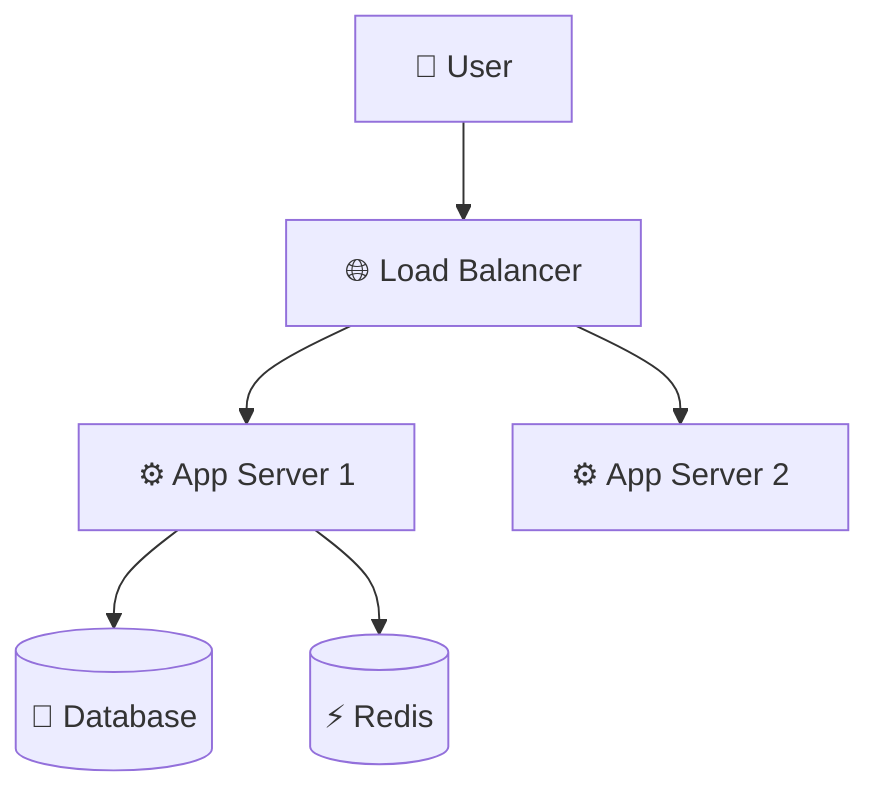
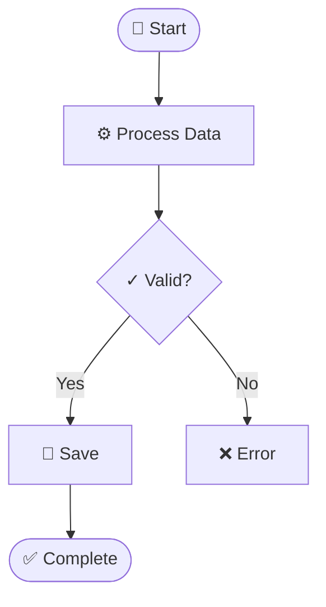
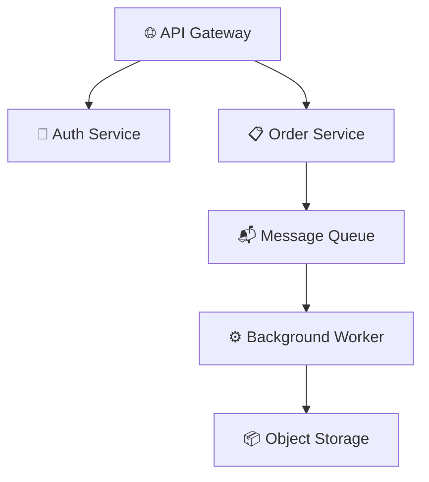

# Mermaid Creator

Mermaid diagram and documentation system with specialized guides and code-to-diagram capabilities.

## Workflow

1. **Analyze user intent** → Use the Diagram Type Selection Matrix below to pick the right diagram
2. **Load relevant resources** → On-demand loading of guides, templates, and utilities
3. **Generate output** → Create Mermaid syntax, diagrams, or documentation based on user request

## Diagram Type Selection Matrix

| When You Need To... | Use This Diagram | Best For |
|---------------------|------------------|----------|
| Show system boundaries and external actors | [C4 Context](https://mermaid.ai/open-source/syntax/c4.html) | System context, stakeholder view |
| Document API calls and timing | [Sequence Diagram](https://mermaid.ai/open-source/syntax/sequenceDiagram.html) | API flows, interactions, temporal behavior |
| Model object relationships and inheritance | [Class Diagram](https://mermaid.ai/open-source/syntax/classDiagram.html) | OOP design, code structure |
| Visualize database schema | [ER Diagram](https://mermaid.ai/open-source/syntax/entityRelationshipDiagram.html) | Data model, relationships |
| Show state transitions and lifecycle | [State Diagram](https://mermaid.ai/open-source/syntax/stateDiagram.html) | Workflows, status changes |
| Document decision flows and algorithms | [Flowchart](https://mermaid.ai/open-source/syntax/flowchart.html) | Business logic, processes |
| Map hierarchical concepts | [Mind Map](https://mermaid.ai/open-source/syntax/mindmap.html) | Brainstorming, concept organization |
| Track project timeline | [Gantt Chart](https://mermaid.ai/open-source/syntax/gantt.html) | Project planning, milestones |
| Capture user experience | [User Journey](https://mermaid.ai/open-source/syntax/userJourney.html) | UX flows, user interactions |
| Show infrastructure components | [Architecture Diagram](https://mermaid.ai/open-source/syntax/architecture.html) | Deployment, infrastructure |
| Show proportional data | [Pie Chart](https://mermaid.ai/open-source/syntax/pie.html) | Distribution, percentages |
| Plot data on X/Y axes | [XY Chart](https://mermaid.ai/open-source/syntax/xyChart.html) | Trends, comparisons |
| Classify items on two dimensions | [Quadrant Chart](https://mermaid.ai/open-source/syntax/quadrantChart.html) | Prioritization, risk matrices |
| Show chronological events | [Timeline](https://mermaid.ai/open-source/syntax/timeline.html) | History, milestones narrative |
| Visualize Git branching | [Git Graph](https://mermaid.ai/open-source/syntax/gitgraph.html) | Branching strategy, release flow |
| Model requirements traceability | [Requirement Diagram](https://mermaid.ai/open-source/syntax/requirementDiagram.html) | Specs, compliance |
| Visualize flow quantities | [Sankey Diagram](https://mermaid.ai/open-source/syntax/sankey.html) | Energy, resource, cost flows |
| Manage work items visually | [Kanban Board](https://mermaid.ai/open-source/syntax/kanban.html) | Task tracking, workflow stages |
| Describe network packets | [Packet Diagram](https://mermaid.ai/open-source/syntax/packet.html) | Protocol headers, binary formats |
| Show block-level structure | [Block Diagram](https://mermaid.ai/open-source/syntax/block.html) | System blocks, high-level layout |
| Multi-axis comparison | [Radar Chart](https://mermaid.ai/open-source/syntax/radar.html) | Skill maps, feature comparison |
| Hierarchical area proportions | [Treemap](https://mermaid.ai/open-source/syntax/treemap.html) | Disk usage, budget breakdown |
| Model interactions (ZenUML) | [ZenUML](https://mermaid.ai/open-source/syntax/zenuml.html) | Sequence-like, code-style notation |

## Unicode Semantic Symbols

Always use Unicode symbols to enhance diagram clarity.

**Quick Reference:**

- 📦 Infrastructure: ☁️ 🌐 🔌 📡 🗄️
- ⚙️ Compute: ⚙️ ⚡ 🔄 ♻️ 🚀 💨
- 💾 Data: 💾 📦 📊 📈 🗃️ 🧊
- 📨 Messaging: 📨 📬 📤 📥 🐰 📢
- 🔐 Security: 🔐 🔑 🛡️ 🚪 👤 🎫
- 📝 Monitoring: 📝 📊 🚨 ⚠️ ✅ ❌

### Infrastructure & Deployment

### Activity Flow with States

### Microservices Architecture

**[See the complete Unicode Symbols Guide here](./references/unicode-symbols.md)**

## Best Practices

1. **Single Responsibility**: One diagram = One concept
2. **Unicode Enhancement**: Always use semantic symbols for clarity
3. **High Contrast**: Never skip the `color:` property in styles
4. **Layout Optimization**: Avoid deep nesting, use concise text, and order definitions to guide the layout engine
5. **Validate Early**: Use scripts to catch syntax errors
6. **Template Reuse**: Leverage existing templates and examples
7. **Load On-Demand**: Only read guides needed for the specific request
8. **Token Efficiency**: Use hierarchical loading instead of reading everything

## Resources
- [Diagram Syntax, Examples & Best Practices](./references/mermaid-diagram-guide.md)
- [Unicode Symbols](./references/unicode-symbols.md)
- Mermaid Syntax: [Official Docs](https://mermaid.ai/open-source/intro/syntax-reference.html)
