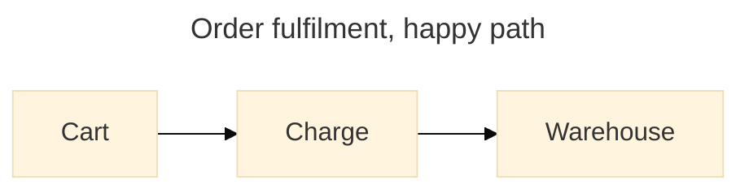

# Mermaid Diagrams

Produce diagrams that render on the reader's renderer, on the first try, in both light and dark themes.

## Settle three things before typing any syntax

1. **The target renderer.** It decides which diagram types exist at all. GitHub, GitLab, VS Code preview, Obsidian and mermaid.live each pin a different Mermaid version, and embedded renderers lag the current release (11.16 as of 2026-08). When it is unknown, ask, or restrict to the stable tier in [references/diagram-types.md](./references/diagram-types.md).
2. **The one question the diagram answers.** Write it down as a sentence. It becomes the `title`, it drives the type choice, and anything that does not help answer it gets cut.
3. **Whether a diagram is the right medium.** A list of three steps is a list. Reach for a diagram when the reader needs to see *relationships* — order, containment, branching, flow — not when they need to read facts in sequence.

## Workflow

1. [ ] **Name the question.** One sentence. If it needs an "and", that is two diagrams.
2. [ ] **Pick the type** from the matrix below; confirm the opening keyword and stability tier in [references/diagram-types.md](./references/diagram-types.md). Never guess a `-beta` suffix.
3. [ ] **Write the header block** — frontmatter `config:` plus `accTitle`/`accDescr` (see below). Do this before the body; it is the part most often forgotten.
4. [ ] **Write the body**, working from [references/syntax-recipes.md](./references/syntax-recipes.md) for the minimal correct skeleton and the traps specific to that type.
5. [ ] **Style only if it carries meaning** — see [references/styling-and-theming.md](./references/styling-and-theming.md). Decoration is a cost, not a feature.
6. [ ] **Validate** — `node scripts/check-mermaid.mjs <file>`. Do not report a diagram as finished without a clean run.

## Pick the type by the question it answers

| The diagram must answer... | Type | Opening keyword |
| --- | --- | --- |
| What are the steps, branches and loops of a process? | Flowchart | `flowchart TD` |
| ...and who owns each step? | Swimlanes | `swimlane-beta LR` |
| Who calls whom, in what order, and what comes back? | Sequence | `sequenceDiagram` |
| What states can this be in, and what moves it between them? | State | `stateDiagram-v2` |
| What entities exist and how do they relate and key off each other? | ER | `erDiagram` |
| What types exist and how do they inherit, compose and depend? | Class | `classDiagram` |
| Who and what sits outside the system boundary? | C4 | `C4Context` |
| What runs where, on which infrastructure? | Architecture | `architecture-beta` |
| How is the repository branched, merged and released? | Git graph | `gitGraph` |
| When does each piece of work happen, and what blocks what? | Gantt | `gantt` |
| What is the shape of an idea space? | Mind map | `mindmap` |
| How does a user feel at each step? | User journey | `journey` |
| Where do these items land against two dimensions? | Quadrant | `quadrantChart` |
| How do quantities split and flow between stages? | Sankey | `sankey-beta` |

Seventeen further types — pie, xychart, kanban, timeline, treemap, radar, venn, packet, block, requirement, treeView, wardley, cynefin, ishikawa, eventmodeling, railroad, ZenUML — with their exact keywords and stability tiers are in [references/diagram-types.md](./references/diagram-types.md). Consult it whenever the matrix above has no clean fit; do not force a flowchart onto a problem that has a purpose-built type.

## Every diagram gets a header block



- `accTitle:` is **single-line**. `accDescr:` is single-line; `accDescr { ... }` is the multi-line form and takes **no colon**. Both are supported on every diagram type and emit `<title>`/`<desc>` plus `aria-labelledby`/`aria-describedby` in the SVG. A diagram without them is unreadable to a screen reader and to anyone reading the raw Markdown.
- YAML frontmatter `config:` is the supported way to configure a single diagram. `%%{init: ...}%%` has been **deprecated since v10.5.0**.
- `look: handDrawn|classic` and `layout: dagre|elk` are flowchart- and state-diagram-only, and `elk` must be registered by the host — it is not bundled, so it silently falls back or fails on GitHub.

## Gotchas

- **Lowercase `end` breaks flowcharts and sequence diagrams.** The parser takes it as a block terminator. Capitalise it (`End`) or enclose it: `(end)`, `[end]`, `{end}`.
- **A node id starting with `o` or `x` directly after an edge is parsed as an arrowhead.** `A---oB` is a circle edge, not a link to `oB`. Add a space (`A--- oB`) or capitalise the id.
- **Node ids are global; labels are not.** Writing the same id inside a second `subgraph` moves that node into it rather than creating a second one. Give every distinct box a distinct id.
- **A subgraph's `direction` is ignored the moment any node inside it links outside.** It then inherits the parent graph's direction. Only fully internal subgraphs keep their own.
- **Quote any label containing punctuation** — `A["Order (paid)"]`. For characters the parser still swallows, use entity codes: `#quot;` for `"`, `#35;` for `#`.
- **`#` is comment syntax in several parsers.** Hex colours are unsupported in sequence-diagram `box` declarations for exactly this reason; use a CSS colour name there.
- **`click` and `href` do nothing on GitHub.** Its `securityLevel` strips interaction. Never make a README diagram depend on being clickable.
- **Architecture diagrams ship five icons**: `cloud`, `database`, `disk`, `internet`, `server`. Every other icon name needs an iconify pack registered by the host and renders as an empty box otherwise.
- **ZenUML is an external plugin**, not part of the bundle. Assume it fails anywhere except mermaid.live and hosts that explicitly register it.
- **Fills without a matching `color:` become unreadable in the opposite colour scheme.** GitHub and VS Code render the same block in both. Prefer `theme: base` with `themeVariables`; see [references/styling-and-theming.md](./references/styling-and-theming.md).

## Validate before shipping

```sh
node scripts/check-mermaid.mjs README.md docs/*.md
```

Checks every fenced `mermaid` block for an unrecognised opening keyword, a beta or external type that the target renderer may reject, the deprecated `%%{init}%%` directive, a missing accessibility header, and unbalanced quotes. Exits non-zero on any error and prints a per-block result table.

For a true parse, render it: `npx -y @mermaid-js/mermaid-cli@11 -i diagram.mmd -o /tmp/out.svg` (downloads Chromium on first run). The script invokes `mmdc` automatically when it is already on `PATH`. Static checks catch the common failures; only a render proves the diagram parses — say which of the two was run.

## References

- [references/diagram-types.md](./references/diagram-types.md) — every type Mermaid ships: opening keyword, what it answers, stability tier, and how to choose between near-neighbours.
- [references/syntax-recipes.md](./references/syntax-recipes.md) — minimal correct skeleton and per-type traps for the common types.
- [references/styling-and-theming.md](./references/styling-and-theming.md) — themes, `themeVariables`, `classDef`, and staying legible in dark mode.
- [scripts/check-mermaid.mjs](./scripts/check-mermaid.mjs) — the validator above.
- Authoritative syntax spec: [mermaid-js/mermaid `docs/syntax`](https://github.com/mermaid-js/mermaid/tree/develop/docs/syntax) — one file per diagram type, always ahead of the rendered site.
- Rendered docs: [mermaid.js.org](https://mermaid.js.org/intro/syntax-reference.html) · Live editor: [mermaid.live](https://mermaid.live/)
